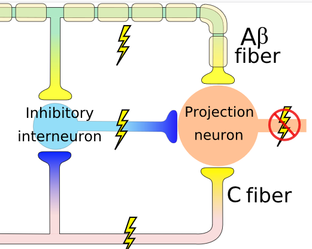

# Neuronauka a ból

---

# Nocycepcja

* Aktywacja receptorów bólowych i dróg przewodzenia bodźców bólowych (*pain pathways*)
* Jeśli wszystko jest w porządku, skutkuje odczuciem ostrego bólu
* Proces stricte fizjologiczny (?)

---

# Nocycepcja

* Nocyreceptory - receptory reagujące na informację bólową, obecne w skórze, mięśniach, stawach etc.
* Bodźce bólowe przewodzone są poprzez dwa rodzaje włókien:
    * Aδ - z osłoną mielinową - szybkie przewodnictwo
    * C - bez osłony - wolne przewodnictwo, tzw. "drugi ból"
* Zakończenia włókien w korzeniu grzbietowym nerwu rdzeniowego

---

# Nocyreceptory

* Niektóre wyczulone specyficznie na różne typy stymulacji, np. ciepło, ucisk, oparzenia chemiczne itd.
* Receptory różnią się progiem aktywacji - niektóre (tzw. "ciche" receptory) potrzebują bardzo dużej stymulacji żeby się uaktywnić

---

# Nocyreceptory

* Większość receptorów włókien C nie ulega habiutacji tylko **sensytyzacji**
* W trakcie przedłużającej się stymulacji bólowej aktywować mogą się dodatkowe, bardziej odległe receptory
* Nocycepcja może się utrzymywać, nawet jeśli **nie ma już pierwotnego źródła bólu**

---

# Teoria bramkowania (Melzack, Wall)

---

# Teoria bramkowania (Melzack, Wall)

---

# Teoria bramkowania (Melzack, Wall)

* W swoim rozwinięciu teoria bramkowania mówi, że mechanizm bramki może być regulowany przez mechanizmy centralne
* Nie bardzo wiadomo jakie mechanizmy centralne

---

# Transmisja informacji bólowej

- Z nocyreceptorów przez włókna Aδ i C do rdzenia kręgowego
- W rdzeniu pierwsze "przetwarzanie"
- Z rdzenia kręgowego do wzgórza (*spinothalamic tract*)
- Z wzgórza do kory

---

# Transmisja informacji bólowej

--- 

---

# Przetwarzanie informacji bólowej w CUN
- Móżdżek (Cb)
- Wzgórze (Thal)
- Wyspa (Ins)
- Przednia część zakrętu obręczy (ACC)
- PIerwszorzędowa kora czuciowa (SI)
- Drugorzędowa kora czuciowa (SII)
- Dodatkowa kora ruchowa (SMA)

---

# Przewtwarzanie bólu w CUN

---

# Modulacja bólu
- Modulacja bólu - zmiana odczuć bólowych (analgezja lub hiperalgezja) na skutek innych procesów, również psychologicznych
- DPMS - *Descending Pain Modulation System*
- Istota szara okołowodociągowa (PAG)
- Z perspektywy psychologicznej istotna modulacja *emocjonalna* i *poznawcza*

---

# Modulacja bólu

---

# Emocjonalna (afektywna) modulacja bólu
- Pozytywny afekt naczęściej **zmniejsza** nasilenie bólu
- Negatywny afekt najczęściej **zwiększa** nasilenie bólu
- Nie zawsze - *stress-induced analgesia*
- Istotne uwikładnie układu limbicznego w przetwarzanie i modulację bólu (ACC)
- Związki bólu z depresją

---

# Poznawcza modulacja bólu
- Konentracja uwagi na bólu **zwiększa** ból
- Odwrócenie uwagi od bólu **zmniejsza** ból
- Efekt placebo
- Efekt nocebo

---

# Przetwarzanie predykcyjne

---

# PP

- Predictive processing (przetwarzanie predykcyjne)
- Predictive coding (kodowanie predykcyjne)
- Active inference (aktywne wnioskowanie)

---

# Herman von Helmholtz (1821 - 1894)

---

# Karl Friston

---

# PP - o co chodzi?

Percepcja jest kombinacją:

- **Predykcji** opartych na wiedzy
- Danych sensorycznych potwierdzających (lub nie) te predykcje

---

# PP - o co chodzi?

Percepcja jest kombinacją:

- procesów **zstępujących** (top-down)
- procesów **wstępujących** (bottom-up)

---

# Percepcja to kontrolowana halucynacja

- Wykorzystujemy probabilistyczną wiedzę, żeby tworzyć **generatywny model świata**
- Model ten wykorzystujemy do **konstruowania** doświadczeń percepcyjnych

---

# Mózg jako maszyna do tworzenia predykcji

- Mózg (UN) to wielowarstwowe, wieloośrodkowe, hierarchiczne urządzenie, które non-stop zajmuje się **przewidywaniem własnych stanów sensorycznych** (eksterocepcji, interocepcji, propriocepcji)
- **Hierarchiczne**, ponieważ _wyższe_ struktury cały czas starają się przewidzieć stany _niższych_ struktur

---

# Błędy predykcji (prediction errors)

- Jeśli stany sensoryczne zgodne są z modelem/przewidywaniami: wszystko jest ok
- Jeśli nie: powstają błędy predykcji, które uaktualniają model tak, by lepiej przewidywał stany
- To jest **uczenie się**

---

# Precyzja

- _Self-estimated sensory uncertainty - precision_
- Błędy predykcji mogą wynikać z różnych przyczyn
- W nocy widzimy mniej niż w dzień
- Mózg zdaje sobie sprawę z niepewności związanej z błędami predykcji
- Im większa niepewność/mniejsza precyzja, tym błędy mają mniejszą szansę wpłynąć na model generatywny

---

# Precyzja a uwaga

- W PP ten mechanizm utożsamiany jest z **uwagą**
- Jeśli kierujemy na coś uwagę, zwiększamy precyzję błędów predykcji
- Zwiększając precyzję, zwiększamy szansę na zmianę modelu świata

---

# PP to nie tylko percepcja

- PP sugeruje, że tworzenie modeli jest naczelną zasadą organizującą systemy biologiczne!
- W tym sensie aplikowane jest do wszystkich obszarów funkcjonowania umysłu

---

# PP to nie tylko teoria! 

- PP to zasada, wg. której skonstruowane są układy nerwowe!
- Mózgi ssaków mają architekturę, która pozwala na PP (mają?)

---

# Predykcje w życiu

200km/h!

---

# Proste przykłady

---

# Proste przykłady

<https://michaelbach.de/ot/mot-flashLag/index.html>

---

# Od PP do free energy principle

---

# Problemy z PP

- Teoria wszystkiego?
- Falsyfikowalność?
- Czy PP to wszystko, czy jest coś jeszcze?
- Czy PP tłumaczy celowość, moralność, inne ludzkie przywary?
- Czy free energy principle się zgadza?

---

# Jeśli kogoś to zainteresowało...

[Anil Seth: Your brain hallucinates your conscious reality](https://www.youtube.com/watch?v=lyu7v7nWzfo)

[Andy Clark: Happily Entangled: Emotions Cognition and the Predictive Mind](https://www.youtube.com/watch?v=OS3RM3F8YmE)

---

# Książki o PP

Jakob Hohwy, The Predictive Mind (2014), Oxford University Press

---

# Książki o PP

